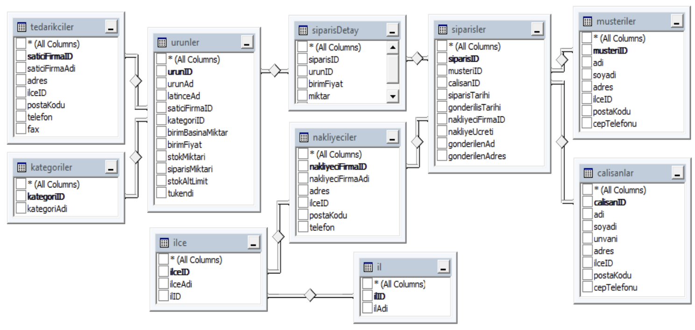
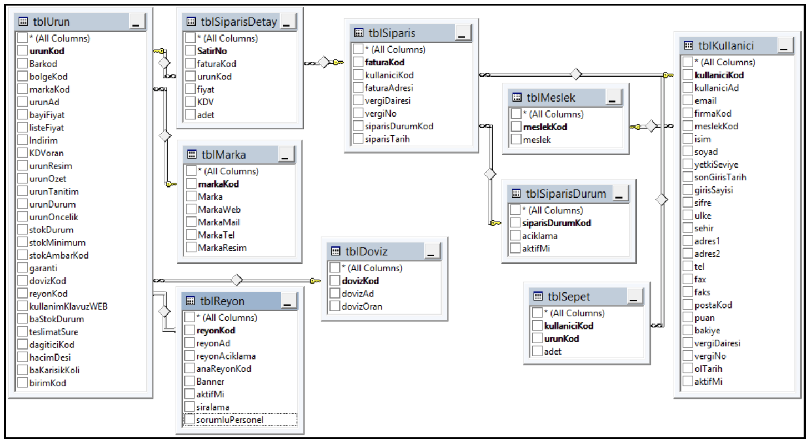

# stranger-queries
practice a few SQL queries

**ÇALIŞMA-1:** Aşağıdaki verilen “satıcı” veritabanını dikkate alarak:



1. Satıcı veritabanında yer alan çalışanların; adlarının uzunluğu, adlarının soldan ilk iki harfinin ne olduğunu, adının tamamını büyük harfe çeviren ve çalışanın adını tersen yazan SQL ifadesi;

```sql
SELECT adi,
LEN(adi) as "uzunluk",
LEFT(adi,2) as "soldan uc harf",
UPPER(adi) as "büyük",
REVERSE(adi) as "tersten"
FROM calisanlar
```

2. Satıcı veritabanında yer alan çalışanların maaş ortalamasını hesaplayacak SQL ifadesi;

```sql
select avg(maasi) as "ortalama"
from calisanlar
```

3. Satıcı veritabanında yer alan ürünler tablosunu dikkate alarak, saticiFirmaID’si 2 olan ürünlerin ortalama birim fiyatını hesaplayacak SQL ifadesi;

```sql
select avg(birimFiyat) as "ortalama fiyat"
from urunler
where "saticiFirmaID"=2
```
4. Satıcı veritabanında yer alan ürünler tablosunu dikkate alarak, toplam stokMiktarını hesaplayacak SQL ifadesi;

```sql
select count(stokMiktari) as "toplam stok miktari"
from urunler
```
5. Satıcı veritabanında yer alan ürünler tablosunu dikkate alarak, satıcıFirmaID’si 3 olan bitkilerin toplam stokMiktarını hesaplayacak SQL ifadesi;
```sql
select count(stokMiktari) as "saticiID 3 olan bitkiler"
from urunler
where "saticiFirmaID"=3
```
6. Ürünlerin birimFiyat’larını göz önünde bulundurduğumuzda, en düşük ve en yüksek birimFiyat’ın ne olduğunu listeleyen SQL ifadesi;
```sql
select MIN(birimFiyat) as "en dusuk fiyat", MAX(birimFiyat) as "en yuksek fiyat"
from urunler
```
7. En düşük stok miktarına sahip ürünün hangisi olduğunu bulan SQL ifadesi;
```sql
select urunAd
from urunler
where stokMiktari=(select MIN(stokMiktari) from urunler)
```
8. Satıcı veritabanında yer alan ürünler tablosunu dikkate alarak, saticiFirmaID’si 1 olan firmanın kaç çeşit ürün tedarik ettiğini bulan SQL ifadesi;
```sql
select COUNT(urunAd) as "urun cesit sayisi"
from urunler
where "saticiFirmaID"=1
```

**ÇALIŞMA-2:** Aşağıdaki verilen “dukkan” veritabanına ait tabloları dikkate alarak:




1. Ürünler tablosunda ürün numarası 3200 olan ürünün listefiyatı ve adını bulan SQL ifadesi;
```sql
select urunAd,listeFiyat
from tblUrun
where "urunKod"=3200
```
2. Ürün listefiyatı 150 TL ile 1000 TL arasında olan ürünlerin adı ve bayifiyatlarını bulan SQL ifadesi;
```sql
select urunAd,bayiFiyat
from tblUrun
where listeFiyat between 150 and 1000
```
3. Ürün listefiyatı 150 TL ile 1000 TL arasında olan ürünlerin sayısını bulan SQL ifadesi;
```sql
select COUNT(urunKod) as "150 ile 1000 tl arasindaki urunlerin sayisi"
from tblUrun
where listeFiyat between 150 and 1000
```
4. Ürün kodu 3200, 3210, 3150 ve 3400 olan ürünlerin ürünad, listefiyat ve bayifiyatlarını bulan SQL ifadesi;
```sql
select urunKod,urunAd,listeFiyat,bayiFiyat
from tblUrun
where urunKod in (3200,3210,3150,3400)
```
5. Ürün listefiyatı 150 TL ile 1000 TL arasında olan ürünleri, ürün adlarına göre büyükten küçüğe doğru sıralayan SQL ifadesi;
```sql
select urunAd 
from tblUrun
where listeFiyat between 150 and 1000
order by urunAd desc
```

6. Ürün listefiyatı 150 TL ile 1000 TL arasında olan ürünleri ürün adlarına göre büyükten küçüğe, ürün kodlarına göre küçükten büyüğe doğru sıralayan SQL ifadesi;
```sql
select urunAd,urunKod
from tblUrun
where listeFiyat between 150 and 1000
order by urunAd desc, urunKod asc
```
7. Ürün adları içerisinde ‘klavye’ kelimesi geçen kayıtları listeleyen SQL ifadesi;
```sql
select urunAd as "klavye gecen kelimeler"
from tblUrun
where urunAd like '%klavye%'
```
8. Ürün adı K ile başlayan ürünleri listeleyen SQL ifadesi;
```sql
select urunAd as "K harfi ile baslayan urunler"
from tblUrun
where urunAd like 'K%'
```
9. Ürün adı K ile biten ürünleri listeleyen SQL ifadesi;
```sql
select urunAd as "K harfi ile biten urunler"
from tblUrun
where urunAd like '%K'
```
10. Ürün adının ikinci harfi S olan ürünleri listeleyen SQL ifadesi;
```sql
select urunAd as "ikinci harfi S olan urunler"
from tblUrun
where urunAd like '_S%'
```
11. Ürün adları içerisinde ‘klavye’ kelimesi geçen kayıtları ürün adlarına göre büyükten küçüğe doğru sıralayarak listeleyen SQL ifadesi;
```sql
select urunAd as "klavye iceren buyukten kucuge"
from tblUrun
where urunAd like '%klavye%'
order by urunAd desc
```
12. Ürün adı K ile başlayan ürünleri ürün adlarına göre büyükten küçüğe doğru sıralayan SQL ifadesi;
```sql
select urunAd as "K ile baslayan urunler buyukten kucuge"
from tblUrun
where urunAd like 'K%'
order by urunAd desc
```
13. Ürün adı K ile biten ürünleri ürün adlarına göre büyükten küçüğe doğru sıralayan SQL ifadesi;
```sql
select urunAd as "K ile bitenler buyukten kucuge"
from tblUrun
where urunAd like '%K'
order by urunAd desc
```
14. Ürün adının ikinci harfi S olan ürünleri ürün adlarına göre büyükten küçüğe doğru sıralayan SQL ifadesi;
```sql
select urunAd "ikinci harfi s olanlar buyukten kucuge"
from tblUrun
where urunAd like '_S%'
order by urunAd desc
```
15. Ürün adının üçüncü harfi A olan ürünleri ürün adlarına göre büyükten küçüğe doğru sıralayan SQL ifadesi;
```sql
select urunAd as "ucuncu harfi A olanlar buyukten kucuge"
from tblUrun 
where urunAd like '__A%'
order by urunAd desc
```
16. Ürünlerin listefiyatları toplamını bulan SQL ifadesi;
```sql
select sum(listeFiyat) as "urunlerin liste fiyatları toplami"
from tblUrun
```

17. Stokta yer alan ürünlerden birer tane bulunduğunu varsayarak, stokta toplam kaç liralık ürün olduğunu hesaplayan SQL ifadesi;
****


18. Stokta yer alan ürünlerden birer tane bulunduğunu varsayarak, bu ürünlerin hepsinin satılması durumunda ne kadarlık kar elde edilebilir hesaplayan SQL ifadesi;
****

19. Ortalama listefiyatı ve bayifiyatını bulan SQL ifadesi;
```sql
select avg(listeFiyat) as "ortalama liste fiyat", avg(bayiFiyat) as "ortalama bayi fiyat"
from tblUrun
```
20. Listefiyatı en düşük olan ürünün ürünadı ve barkodunu bulan SQL ifadesi;
```sql
select urunAd,Barkod
from tblUrun
where listeFiyat=(select min(listeFiyat) from tblUrun)
```
21. Listefiyatı en yüksek olan ürünün ürünadı ve barkodunu bulan SQL ifadesi;
```sql
select urunAd,Barkod
from tblUrun
where listeFiyat=(select max(listeFiyat) from tblUrun)
```
22. Ürünler tablosunda toplam kaç kayıt olduğunu bulan SQL ifadesi;
```sql
select count(urunKod) as "toplam urun sayisi"
from tblUrun
```
23. Ürün adının ikinci harfi A olan ürünlerden kaç adet olduğunu bulan SQL ifadesi;
```sql
select count(urunAd) as "ikinci harfi A olan urunlerin sayisi"
from tblUrun
where urunAd like '_A%'
```
24. Listefiyatlarını bir üst tamsayıya yuvarlayınız ve ürünadları ile birlikte listeleyen SQL ifadesi;
```sql
select ceiling(listeFiyat) as "ceiling fiyatlar", urunAd
from tblUrun
```
25. Listefiyatlarını bir alt tamsayıya yuvarlayınız ve ürünadları ile birlikte listeleyen SQL ifadesi;
```sql
select floor(listeFiyat) as "floor fiyatlar", urunAd
from tblUrun
```
26. Listefiyatı en yüksek olan ürünün markasının adını bulan SQL ifadesi;
```sql
select tblMarka.Marka
from tblUrun inner join tblMarka on tblUrun.markaKod=tblMarka.markaKod
where tblUrun.listeFiyat=(select max(tblUrun.listeFiyat) from tblUrun)
```

**ÇALIŞMA-3:** “Dukkan” veritabanını dikkate alarak:


1. Ürün kodu 3200 olan ürünün markasını bulan SQL ifadesini yazınız.
```sql
select M.Marka
from tblUrun U inner join tblMarka M on U.markaKod=M.markaKod
where U.urunKod=3200
```
2. Ürün kodu 3200 olan ürünün markası ve döviz adını bulan SQL ifadesi;
```sql
select M.Marka,D.dovizAd
from tblUrun U
inner join tblMarka M
on U.markaKod=M.markaKod
inner join tblDoviz D
on D.dovizKod=U.dovizKod
where U.urunKod=3200
```
3. TblSiparis tablosunda fatura kodu 6 olan ürünün adı, markası ve sipariş tarihini ekrana listeleyen SQL ifadesi;
```sql
select U.urunAd,M.Marka,S.siparisTarih
from tblSiparis S
inner join tblSiparisDetay SD
on S.faturaKod=SD.faturaKod
inner join tblUrun U
on U.urunKod=SD.urunKod
inner join tblMarka M
on M.markaKod=U.markaKod
```
4. Fatura kodu 18 olan siparişi hangi kullanıcının verdiğini bulan SQL ifadesi;
```sql
select K.kullaniciAd
from tblSiparis S
inner join tblKullanici K
on S.kullaniciKod=K.kullaniciKod
where S.faturaKod=18
```
5. Fatura kodu 18 olan ürünün sipariş durumunu getiren SQL ifadesi;
```sql
select SD.aciklama
from tblSiparis S
inner join tblSiparisDurum SD
on S.siparisDurumKod=SD.siparisDurumKod
where S.faturaKod=18
```
6. Fatura kodu 18 olan siparişi veren müşterinin mesleğini bulan SQL ifadesi;
```sql
select M.meslek
from tblSiparis S
inner join tblKullanici K
on S.kullaniciKod=K.kullaniciKod
inner join tblMeslek M
on K.meslekKod=M.meslekKod
where S.faturaKod=18
```
7. Hangi kullanıcının hangi kodlu üründen kaçar adet sipariş verdiğini listeleyen SQL ifadesi;
```sql
select K.kullaniciAd,U.urunKod,SD.adet
from tblKullanici K
inner join tblSiparis S
on K.kullaniciKod=S.kullaniciKod
inner join tblSiparisDetay SD
on S.faturaKod=SD.faturaKod
inner join tblUrun U
on SD.urunKod=U.urunKod
```
**ÇALIŞMA-4:** “Dukkan” veritabanını dikkate alarak:**GROUP BY ÖRNEKLERİ**
1. Ürünler markaKod sütununa göre gruplandırıldığında, her bir markaKod değerine karşılık kaç ürün düşmektedir?
```sql
select markaKod,count(urunKod)
from tblUrun
group by markaKod
```
2. Liste fiyatı 50 TL’den büyük, 100 TL’den küçük olan ürünlerden kaçar adet olduğunu bulan SQL ifadesi;
```sql
select urunAd,count(*) as "adet sayisi"
from tblUrun
where listeFiyat>50 and listeFiyat<100
group by urunAd
```
3. Her bir marka grubunda kaç adet ürün bulunduğunu görmek istersek bu sorguyu nasıl oluştururuz?
```sql
select M.Marka,COUNT(urunKod) AS "ürün sayısı"
from tblUrun U
inner join tblMarka M
on U.markaKod=M.markaKod
GROUP BY M.Marka
```
4. Liste fiyatı 100 TL ile 500 TL arasında olan ürünlerin, markalarına göre ortalama fiyatlarını görmek istiyoruz. Bu sorguyu nasıl oluştururuz?
```sql
select M.Marka,AVG(U.listeFiyat) AS "Ortalama Fiyat"
from tblUrun U
inner join tblMarka M
on U.markaKod=M.markaKod
where U.listeFiyat>100 AND U.listeFiyat<500
GROUP BY M.Marka
```
**ÇALIŞMA-5:** “Dukkan” veritabanını dikkate alarak:**HAVING ÖRNEKLERİ**

1. 30’un üzerinde ürüne sahip markaların adları ve bu markalarda kaçar adet ürün olduğunu bulan SQL ifadesi;
```sql
select M.Marka,count(*) as "urun sayisi"
from tblUrun U inner join tblMarka M on U.markaKod=M.markaKod
group by M.Marka
having count(*)>30 
GROUP BY M.Marka
```

2. Liste fiyatı 50 TL’den daha pahalı ürünler için her bir marka grubunda ortalama liste fiyatını raporlayın. Sonuçta, 16’dan daha az ürüne sahip markalar yer almasın.
```sql
select U.markaKod,M.Marka,avg(U.listeFiyat) as "ortalama liste fiyatı",count(*) as "urun sayisi"
from tblUrun U inner join tblMarka M on U.markaKod=M.markaKod
where listeFiyat>50
group by U.markaKod,M.Marka
having count(*)>16
```
